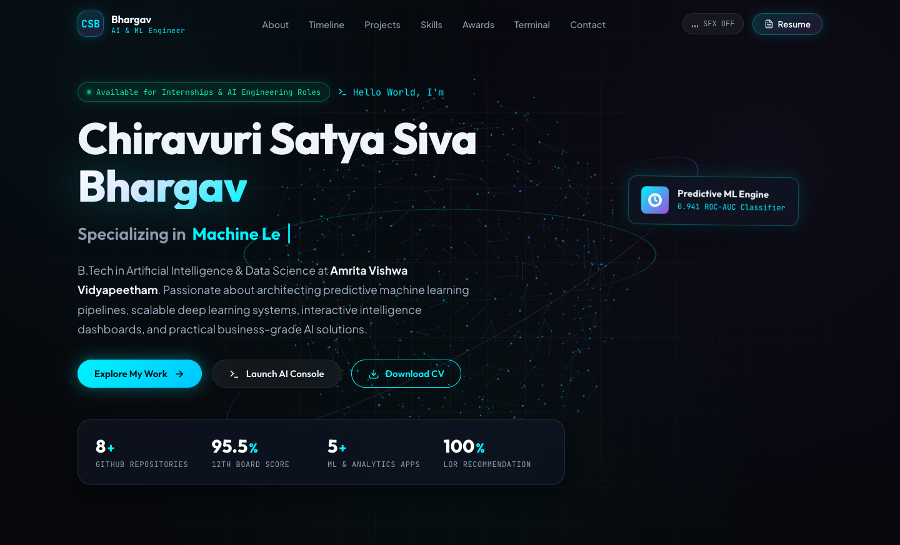

# Chiravuri Satya Siva Bhargav — Modern AI Portfolio

[](http://localhost:3000)

A futuristic, high-performance portfolio website built for **Chiravuri Satya Siva Bhargav**, aspiring **Machine Learning Engineer & Data Scientist**. Designed with a deep cybernetic AI visual aesthetic, interactive 3D WebGL scenes, fluid custom cursor mechanics, synthesized audio micro-interactions, and an interactive command-line terminal emulator.

---

## 🌟 Key Features & Visual Engineering

- **3D Three.js Neural Constellation**: An interactive 3D particle sphere and dynamic synaptic connection matrix in the Hero section that responds smoothly to mouse parallax, touch drag rotation, and click shockwaves.
- **Custom Fluid Glowing Cursor**: Precision dot with lerp-smoothed trailing aura ring, magnetic hover transitions, contextual labels (`EXPLORE`, `COPY`), and stardust spark physics.
- **Interactive AI CLI Terminal**: An embedded command-line interface supporting commands (`help`, `bio`, `skills`, `projects`, `education`, `experience`, `achievements`, `contact`, `resume`, and `sudo hire` with celebratory confetti!).
- **3D Card Tilt Engine with Specular Glare**: Dynamic perspective transforms (`rotateX`, `rotateY`, `perspective(1000px)`) with cursor-following radial light glares across project cards and profile elements.
- **Synthesized Web Audio SFX**: Pure browser-synthesized sci-fi audio feedback for hovers, button clicks, and celebrations (with an animated equalizer toggle in the navbar).
- **Interactive Project Showcase**:
  - Filter by domain (`Machine Learning & DL`, `Data Analytics & Dashboards`, `Web & Canvas AI`).
  - High-resolution UI screenshots of actual projects.
  - Interactive "Architecture" modal detailing system overview, key metrics, and engineering highlights.
  - Direct repository links to GitHub ([`InScript-AI`](https://github.com/Bhargav-ram333/InScript-AI), [`Buiseness_analysis`](https://github.com/Bhargav-ram333/Buiseness_analysis), [`customer_segmentation-analysis`](https://github.com/Bhargav-ram333/customer_segmentation-analysis), [`Telco_Customer_Churn_Analysis`](https://github.com/Bhargav-ram333/Telco_Customer_Churn_Analysis)).
- **Integrated Resume Viewer & Downloader**: View the official resume inside an interactive modal or download directly (`assets/resume.pdf`).
- **Interactive Contact Hub**: One-click copy for email (`sivabhargav2006@gmail.com`) and phone (`(+91) 9989712314`) with toast notifications and direct message transmission.

---

## 📁 Repository Structure

```
PORTFOLIO/
├── index.html              # Semantic HTML5 architecture & SEO meta tags
├── css/
│   └── style.css           # Vanilla CSS design system, glassmorphism & responsive layouts
├── js/
│   ├── three-hero.js       # Three.js 3D interactive neural constellation
│   ├── cursor.js           # Fluid glowing cursor & particle spark trail
│   ├── audio.js            # Web Audio API futuristic sound synthesizer
│   ├── terminal.js         # Interactive AI CLI terminal emulator
│   └── app.js              # 3D tilt engine, modals, filtering & application state
└── assets/
    ├── avatar.jpg          # Profile avatar
    ├── resume.pdf          # Official resume PDF
    ├── inscript_ai.jpg     # InScript AI preview visual
    ├── sales_dashboard.jpg # Sales Analytics dashboard visual
    ├── customer_segmentation.jpg # Customer Segmentation 3D visual
    └── churn_ml.jpg        # Telco Churn ML predictive telemetry visual
```

---

## 🚀 Running Locally

To run the portfolio on your local machine:

1. Open your terminal in this directory:
   ```bash
   cd /Users/bhargavram/Documents/PORTFOLIO
   ```

2. Start a local HTTP server:
   ```bash
   python3 -m http.server 3000
   ```

3. Open your browser and navigate to:
   ```
   http://localhost:3000
   ```

---

## 🌐 Deploying to GitHub Pages

To host this website live at `https://Bhargav-ram333.github.io`:

1. Initialize a git repository (if not already done):
   ```bash
   git init
   git add .
   git commit -m "feat: initial release of futuristic AI portfolio"
   ```

2. Add your GitHub remote and push:
   ```bash
   git branch -M main
   git remote add origin https://github.com/Bhargav-ram333/Bhargav-ram333.github.io.git
   git push -u origin main
   ```

3. Your website will be live at `https://bhargav-ram333.github.io/`!

---

## 📬 Contact & Connect

- **Name**: Chiravuri Satya Siva Bhargav
- **GitHub**: [github.com/Bhargav-ram333](https://github.com/Bhargav-ram333)
- **LinkedIn**: [linkedin.com/in/satya-siva-bhargav](https://linkedin.com/in/satya-siva-bhargav)
- **Email**: [sivabhargav2006@gmail.com](mailto:sivabhargav2006@gmail.com)
- **Phone**: (+91) 9989712314
